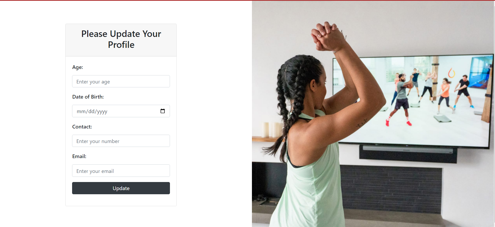

<h1>Using PhpMyAdmin to create a MySQL database and registration table with XAMPP</h1>
In this guide, we will walk you through the process of creating a MySQL database and a registration table using PhpMyAdmin, which is a free and open-source tool for managing MySQL databases. We will be using XAMPP, which is a free and open-source cross-platform web server solution stack package that includes Apache, MySQL, PHP, and Perl.

<h2>Prerequisites</h2>
Before we begin, ensure that you have installed XAMPP on your Windows machine.

<h2>Step 1: Start XAMPP</h2>
To start XAMPP, navigate to the location where it is installed and double-click on the xampp-control.exe file. This will launch the XAMPP Control Panel.

<h2>Step 2: Start Apache and MySQL</h2>
In the XAMPP Control Panel, click on the Start button next to Apache and MySQL to start these services.

<h2>Step 3: Open PhpMyAdmin</h2>
Once Apache and MySQL are running, open your web browser and go to http://localhost/phpmyadmin/. This will open PhpMyAdmin, which is a web-based interface for managing MySQL databases.

<h2>Step 4: Create a new database in test (refer last image)</h2>
In PhpMyAdmin, click on the New button on the left-hand side of the screen. This will open a form where you can enter the details of your new database.

Enter a name for your database in the Database name field, and select utf8_general_ci as the collation. Leave the other settings as they are, and click on the Create button to create your new database.

<h2>Step 5: Create a new table</h2>
Once your database is created, click on its name in the left-hand sidebar to select it. Then, click on the New button to create a new table.

Enter registration as the name of your table, and set the number of columns to 7. Click on the Go button to create your new table.

<h2>Step 6: Define table columns</h2>
In the Structure tab, define the columns of your registration table using the following details:

Click on the Save button to save your table.

<h2>Step 7: Add data to your table</h2>
To add Data in it you need to open register.html file as http://localhost/folder_name/register.html

This Should End Up Like This

Now you can review my Project :)

